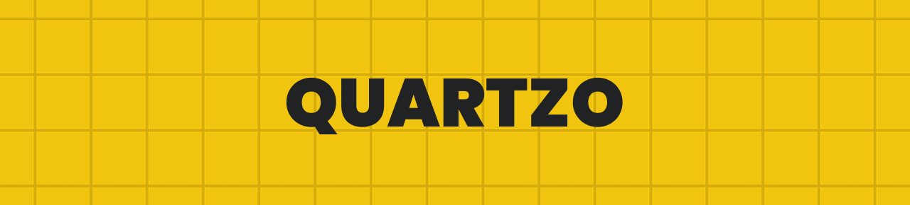

    
    <h1>Hi, I'm Quartzo!</h1>
    

        
        
        
        
    

    

        Lorem ipsum dolor sit amet, consectetur adipiscing elit.
        Proin feugiat sodales tristique. Curabitur varius, metus eu
        venenatis bibendum, eros justo sollicitudin enim, et rutrum
        neque arcu eget ex.
    

